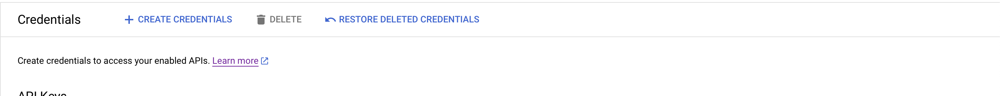
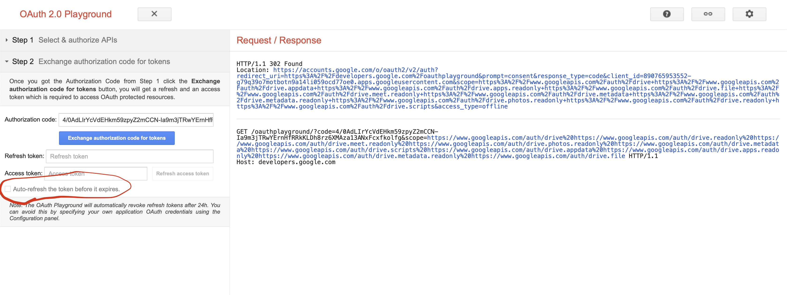

# API Google Drive

## Konfigurasi Google Drive API Library Melalui Google Console
1. Buka [Google Console](https://console.cloud.google.com/)
2. Buat atau Pilih ke Project 

3. Masuk ke APIs & Services yang berada di quick access ataupun di sidebar


4. Setelah Masuk ke menu APIs & Services, Pilih Library

5. Cari Google Drive API, pilih yang google drive API, pada gambar dibawah ini letaknya berada di paling bawah

6. kemudian klik enabled

7. jika sudah maka tampilan akan seperti ini 


## Mendapatkan CredentialsRaw Dari Google Console 
1. Pada halaman APIs & Services, masuk ke menu Credentials


2. Kemudian Tambahkan Credetial Baru 

3. Pilih OAuth Client ID

4. Jika, Oauth Consent Screen Belum DI buat maka buat dulu Oauth Consent screen
5. setelah seselai membuat Oauth Consent Screen maka tampilan akan seperti berikut 

6. klik publish app, kemudian akan muncul popup, maka tekan confirm 

7. kemudian kembali ke halaman credential, dab buar credential baru, dengan tipe oauth client id 

8. aplication type web applicaton, name nya bebas, kemudian pada Authorized redirect URIs isi kan link [https://developers.google.com/oauthplayground](https://developers.google.com/oauthplayground) kemudian klik create

9. setelah berhasil, maka akan muncul popup seperti berikut 

10. Klik download JSON, kemudian arahkan file download ke directory utama

11. buka file tersebut, lalu copy kan seua conten nya, dengan 
```
ctrl + a -> ctrl + c
```
12. kemudian pergi ke folder config/tokenConfig.go dan temukan variabel CREDENTIALRAW
```
var CREDENTIALRAW = []byte(`======>>DATA CREDENTIAL DARI GOOGLE CONSOLE OAUTH CLIENT ID<<======`)
```
13. pastekan value dengan posisi di dalam kurung 
```
var CREDENTIALRAW = []byte(`Value Json From FILE`)
```

## Mendapatkan Access Token dan Refresh Token Dari Google Console 
1. untuk pertama kali, maka kunjungi [google plygorund](https://developers.google.com/oauthplayground) klik setting yang disebelah kanan 

2. checklist pada pilihan Use your own OAuth credentials

3. isikan client_id dan client secret yang ada pada oauth google console, (APIs & Services -> credentials -> pada table oauth client id klik edit atau yang gambar pensil)

4. pada step satu, pilih **Drive API v3**, kemudian klik dan checklist semua scope dibawahnya, kemudian klik authorize APIs

5. kemudian akan di arahkan ke halaman login, dan login dengan akun google yang di inginkan 

6. jika terdapat warning maka klik lanjutkan 

7. kemudian pada step dua checklist **Auto-refresh the token before it expires.** kemudan klik Exchange Authorization code for tokens 

8. kemudian pilih token json yang berada di paling bawah, kemudian copy 

9. pergi ke directory config/tokenConfig.go cari variable TOKENRAW
```
var TOKENRAW = []byte(`=====>>DATA API TOKEN DARI GOOGLE PLAYGROUND<<=====`)
```
10. paste kan value di didalam kurung 
``` 
var TOKENRAW = []byte(`paste jason token disini`)
```
**NOTE**:
 - ketikan melakukan paste jangna menghilangkan `` (tanda petik nya)


## Install Local Machine
1. extract file -> buka terminal di directory api_google_drive
2. jalankan perintah 
```
go mod tidy
```
3. tunggu intalasi selesai
4. setelah instalasi selesai, jalankan perintah 
```
go run main.go
```

## Install Dengan Docker-Compose
1. extract file -> buka terminal di directory api_google_drive
2. jalankan perintah 
```
docker build -t nama_image:nama_tag .
```
3. setelah selesai, jalankan perintah 
```
docker-compose up -d
```

